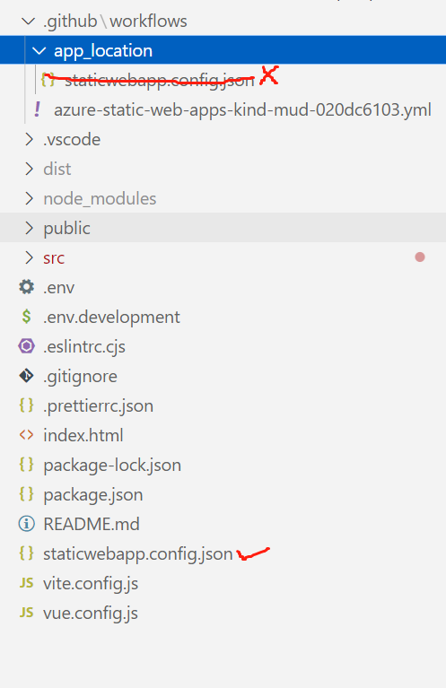

# Configure Azure Static Web Apps

Microsoft official documentation error.

Microsoft modified the routes.json to staticwebapp.config. and the have the documentation below.
[Static web apps configuration file location](https://learn.microsoft.com/en-us/azure/static-web-apps/configuration#file-location)

TOTALLY WRONG!

staticwebapp.config.json should be placed in the root directory, not in the app_location in the workflow file folder or subfolder described in the documentation

